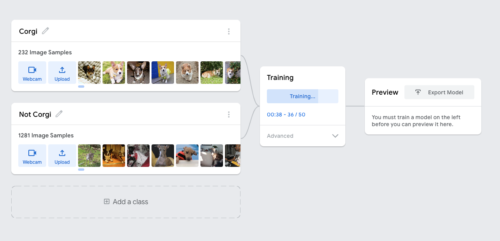

<!-- AUTO-GENERATED-CONTENT:START (STARTER) -->
<p align="center">
  <a href="https://corgy.space">
    
  </a>
</p>
<h1 align="center">
  Corgy Porgy
</h1>


Corgy Porgy is an app that identify a Corgi. Yes, that's the only thing this app can do 😂 .


Inspired by one of [Silicon Valley's episodes](https://www.youtube.com/watch?v=NN1ctbKoXTc) where the cast member Jian Yang created an app called **Seefood**, an app to identify whether the object is a hotdog or not hotdog 😂 😂 😂 .


Using the Tensorflow JS and corgi detection model generated using Teachable Machine to help the app identify a corgi. Made for fun at [CorgiHacks](https://devpost.com/software/corgy-porgy).

`#CorgiHacks` `#madewithTFJS`

<!--  -->

## [See Demo](https://corgy.space/)

# Installation
1. **Clone the repository**

  ```shell
  # copy the repo to your machine

  git clone https://github.com/syauqy/corgyporgy.git
  ```

2. **Start the project**

  ```shell
  # move to the project folder and install all dependencies
  
  cd corgyporgy
  yarn install
  ```

3. **Run the project on your local machine**

  ```shell
  # run Gatsby

  yarn develop
  ```

4. **The project is live 🚀**
  
  Your project is live and running at `http://localhost:8000`

  You can edit the core program at `src/pages/app.js`


# Corgi Model
I generated the corgi model using a Google's Teachable Machine. I'm using two classes for my model. `Corgi` and `Not Corgi`. Each class has several image samples. As you can see below.



The dog's image datasets are from [Stanford Dogs Dataset](https://www.kaggle.com/jessicali9530/stanford-dogs-dataset)


The model itself is not quite good since the corgi classes have fewer samples compare to the not corgi.

You can download and update the existing corgi, not corgi model [here](https://drive.google.com/file/d/1xNQzNB73NbNUtaRC3RCnp3DtrSpJOCRl/view?usp=sharing).

# References & Libraries
* [Tensorflow JS](https://www.tensorflow.org/js) - A Library for ML in JS.

* [Object Detection model (Coco SSD)](https://github.com/tensorflow/tfjs-models/tree/master/coco-ssd) - A model detects objects defined in the COCO dataset, which is a large-scale object detection, segmentation, and captioning dataset.

* [Teachable Machine](https://teachablemachine.withgoogle.com/) - A fast, easy way to create machine learning models, by Google.

* [Stanford Dogs Dataset](https://www.kaggle.com/jessicali9530/stanford-dogs-dataset) - A dog breed dataset, contains images of 120 breeds of dogs from around the world.

### If you want to learn more about Tensorflow JS and object detection model (Coco SSD), please kindly check these amazing videos

* [Machine Learning with TensorFlow in JavaScript](https://www.youtube.com/watch?v=WIHZ7kjJ35o) - by [Jason Lengstorf](https://github.com/jlengstorf) and [Jason Mayes](https://github.com/jasonmayes)

* [Building an Object Detection App with Tensorflow.JS and React.JS in 15 Minutes | COCO SSD](https://www.youtube.com/watch?v=uTdUUpfA83s&ab_channel=NicholasRenotte) - by [Nicholas Renotte](https://github.com/nicknochnack)


<!-- AUTO-GENERATED-CONTENT:END -->
